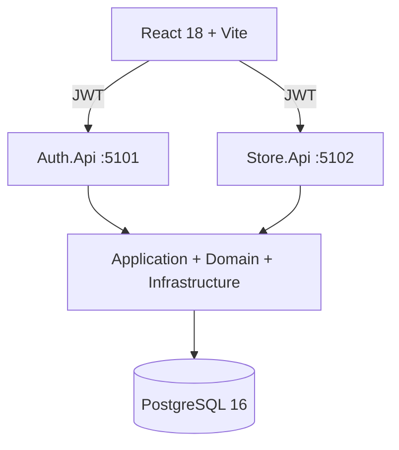
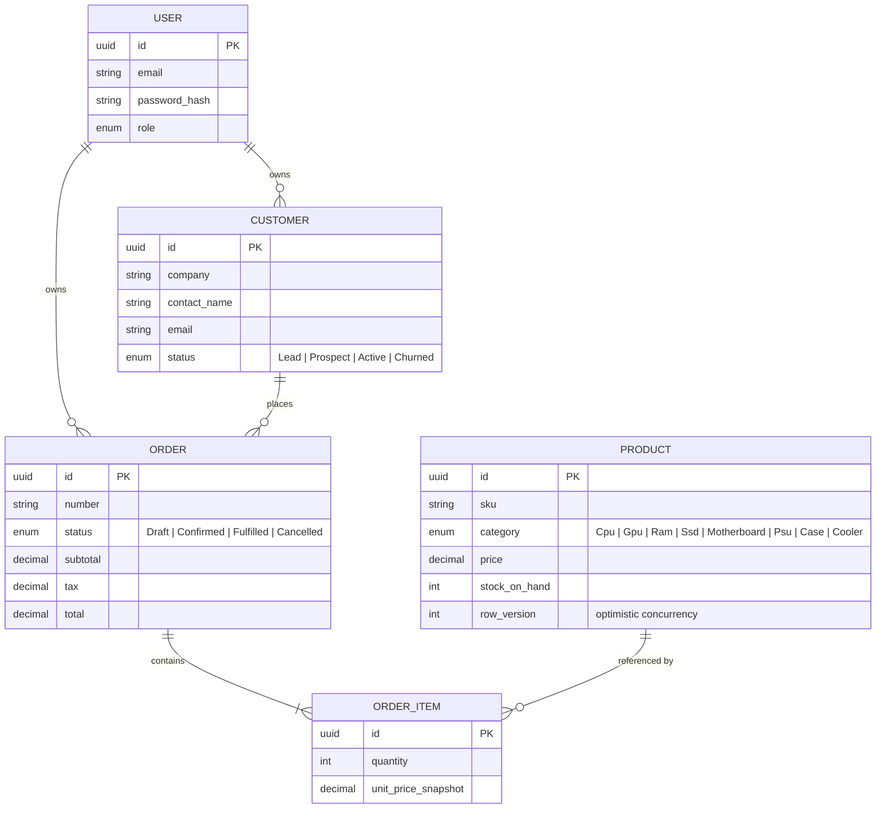

<h1>
  
  &nbsp;Ballastlane Tech Store
</h1>


A small ERP for a computer-parts store - customers, a product catalog (CPUs, GPUs,
RAM, SSDs, motherboards, PSUs, cases, coolers), and **orders with line items that
decrement stock on confirm**.

Built end-to-end for the Ballastlane .NET technical interview: two ASP.NET Core
Web APIs over a shared Clean Architecture core (Domain - Application -
Infrastructure), a React 18 + Vite frontend, ~60 tests across four suites (Domain,
Application, Infrastructure, API integration), and a single `docker compose up`
that brings everything online with seeded demo data and credentials.
Full brief: [`Technical Exercise - .Net`](docs/test.md).

The brief's constraints are architectural, not domain-driven: Clean Architecture
with strict layer separation, TDD across every layer, two Web APIs (one for CRUD
on the domain, a second for user registration / login with authorized and
anonymous endpoints), a data layer with **no EF, Dapper, or MediatR**, an
independent business-logic layer, unit tests across every component, and a
responsive frontend over seeded data.

A parts-store domain was a deliberate pick. Order confirmation gives the business
layer a real invariant to defend - snapshot the line price, decrement stock,
resolve write contention via optimistic concurrency on `row_version` - so the
layered architecture earns its keep instead of degenerating into pass-through CRUD.
The catalog has enough variety (eight categories, real SKUs) to make the
frontend's table + filter + modal flows meaningful rather than placeholder.

**Repository:** <https://github.com/andrade-mcp/ballastlane-tech-store>
**Live demo:** see [Live demo & deployment](#live-demo--deployment)

---

## Table of contents

- [Highlights](#highlights)
- [Architecture](#architecture)
- [Domain model](#domain-model)
- [Tech stack](#tech-stack)
- [Get started](#get-started)
- [Live demo & deployment](#live-demo--deployment)
- [Project structure](#project-structure)
- [Testing](#testing)
- [Engineering notes](#engineering-notes)
- [GenAI usage](#genai-usage)
- [Roadmap](#roadmap)
- [License](#license)

---

## Highlights

- Two ASP.NET Core Web APIs (Auth + Store) sharing one Application + Infrastructure layer.
- Clean Architecture with strict dependency direction - Domain knows nothing of frameworks.
- **No ORM.** Hand-written SQL via `Npgsql`. **No MediatR.** Plain service classes.
- Embedded SQL migrations applied automatically on startup with an idempotent ledger.
- Optimistic concurrency on stock decrement at order confirmation (per-row `row_version`).
- ~60 tests across four suites - Domain, Application, Infrastructure, API integration.
- React 18 + Vite + Tailwind frontend with light/dark theming and a brand CTA component.

---

## Architecture



Dependency rule is one-way: outer layers depend on inner. `Application` defines ports
(`IOrderRepository`, `IPasswordHasher`, etc.) and `Infrastructure` implements them.
Both APIs are composition roots - controllers stay thin and delegate to application
services.

The two-API split is a literal reading of the brief, which asks for "a second API" for
authentication. It also makes the JWT bearer flow across service boundaries an explicit
part of the design rather than an aside.

---

## Domain model



`Order.Confirm()` is the load-bearing piece of the model:

1. Refuses to confirm a draft with zero lines.
2. Snapshots each line's `UnitPrice` from the current product price so a later catalog
   edit cannot retro-modify a closed order.
3. Returns a list of stock decrements; the application layer applies them in a single
   Postgres transaction with optimistic concurrency on `products.row_version`. Two
   reps confirming overlapping orders for the same SKU? The second one's
   `UPDATE … WHERE row_version = $X` updates zero rows and the transaction throws
   `OutOfStockException`.

Tests for this live in
[`tests/BallastlaneTechStore.Domain.Tests/OrderTests.cs`](tests/BallastlaneTechStore.Domain.Tests/OrderTests.cs)
and
[`tests/BallastlaneTechStore.Api.Tests/StoreApiTests.cs`](tests/BallastlaneTechStore.Api.Tests/StoreApiTests.cs).

---

## Tech stack

| Layer        | Choice                                                                |
|--------------|------------------------------------------------------------------------|
| Language     | C# 13 / .NET 9                                                         |
| Web          | ASP.NET Core Web API, JWT bearer auth                                  |
| Persistence  | PostgreSQL 16, hand-written SQL via `Npgsql` (no EF / Dapper)          |
| Migrations   | Embedded `.sql` resources + idempotent runner                          |
| Auth         | `BCrypt.Net-Next` for hashing, `System.IdentityModel.Tokens.Jwt`       |
| Tests        | xUnit, FluentAssertions, NSubstitute, `WebApplicationFactory`          |
| Frontend     | React 18, TypeScript, Vite, Tailwind v3                                 |
| Data fetching| `@tanstack/react-query` + axios with bearer interceptor                |
| Forms        | `react-hook-form` + `zod`                                              |
| Container    | Docker Compose: `postgres` + `auth-api` + `store-api`                  |

---

## Get started

> [!NOTE]
> Migrations and the demo seed run automatically on first API startup - no `dotnet ef`
> step. Postgres is mapped to host port **5434** (not 5432) to avoid clashing with a
> local install.

### Prerequisites

- .NET 9 SDK
- Node.js 20+
- Docker Desktop

### One-command start (Docker)

```bash
docker compose up -d
```

Brings up:

| Service     | Address                | Notes                                          |
|-------------|------------------------|------------------------------------------------|
| `postgres`  | `localhost:5434`       | host port 5434 to dodge any local pg on 5432   |
| `auth-api`  | `http://localhost:5101`| Swagger at `/swagger`                          |
| `store-api` | `http://localhost:5102`| Swagger at `/swagger`                          |

Migrations and demo seed run automatically on first API startup.

### Frontend

```bash
cd web/ballastlane-tech-store-web
npm install
npm run dev
```

Open <http://localhost:5174>.

### Demo credentials

```
email:    demo@ballastlane.dev
password: Demo!2026
```

The seed loads 10 products, 6 big-tech customers spread across the lifecycle, and 3 orders
in different pipeline states.

### Reset the database

```bash
docker compose down -v
docker compose up -d
```

### Without Docker (Postgres only)

```bash
docker compose up -d postgres
dotnet run --project src/BallastlaneTechStore.Auth.Api
dotnet run --project src/BallastlaneTechStore.Store.Api
```

The frontend reads `VITE_AUTH_API` / `VITE_STORE_API` from `.env`; defaults already point
at `http://localhost:5101` / `http://localhost:5102`.

---

## Live demo & deployment

Live at **<https://ballastlane-tech.store/>** - sign in with `demo@ballastlane.dev` /
`Demo!2026`. The seed runs on a fresh database, so the demo credentials work against
the live deployment as well as locally.

Hosted on **AWS**, running the same images built from `docker-compose.prod.yml`.

### AWS resources

| Component                | AWS service                                                                                            |
|--------------------------|--------------------------------------------------------------------------------------------------------|
| Container runtime        | **ECS on Fargate** - one task definition per service (`auth-api`, `store-api`, `web`)                  |
| Image registry           | **Amazon ECR** - private repo per service, tagged with branch + commit SHA                             |
| Database                 | **Amazon RDS for PostgreSQL 16** - same migration ledger applies on first boot                         |
| Edge / TLS / routing     | **Application Load Balancer + AWS Certificate Manager** - host-based routing for the API + web targets |
| DNS                      | **Route 53** - hosted zone for `ballastlane-tech.store`                                                |
| Secrets                  | **AWS Secrets Manager** - JWT signing key and DB credentials, injected as env into the ECS task        |
| Logs                     | **Amazon CloudWatch Logs** - stdout from both APIs and the nginx web container                         |
| CI identity              | **IAM OIDC role** - GitHub Actions assumes a deploy role; no long-lived AWS keys in the repo           |

### CI/CD pipeline

GitHub Actions on push to `main`:

1. **Restore, build, test** - `dotnet restore`, `dotnet build`, `dotnet test` across
   all four suites (Domain, Application, Infrastructure, API integration). The
   frontend runs `npm ci` and `npm run build` as an early compile check. Pipeline
   aborts on red.
2. **Authenticate to AWS** - `aws-actions/configure-aws-credentials@v4` assumes the
   deploy role via **OIDC**; no static `AWS_ACCESS_KEY_ID` lives in repo secrets.
3. **Build & push images** - Docker buildx builds `auth-api`, `store-api`, and `web`
   in parallel, tagging each as `${ECR_URI}/<service>:${{ github.sha }}` plus
   `:latest`, and pushes to **ECR**.
4. **Render task definitions** -
   `aws-actions/amazon-ecs-render-task-definition@v1` substitutes the new image
   SHAs into the existing task-def JSON checked into the repo.
5. **Rolling deploy** - `aws-actions/amazon-ecs-deploy-task-definition@v2` updates
   each ECS service. The ALB drains old tasks once new tasks pass target-group
   health checks, then terminates them. **Rollback** is a re-run of the previous
   workflow with the prior SHA - no manual console steps.

Migrations and the demo seed stay owned by the application: each API runs its
embedded migration ledger on startup, so the pipeline does not need a separate
`migrate` step. Adding one is a `0002_*.sql` drop-in, not a workflow change.

---

## Project structure

```
src/
├── BallastlaneTechStore.Domain/
│   ├── Common/             DomainException.cs
│   ├── Entities/           User.cs, Customer.cs, Product.cs, Order.cs, OrderItem.cs
│   └── Enums/              Enums.cs (Role, CustomerStatus, ProductCategory, OrderStatus)
├── BallastlaneTechStore.Application/
│   ├── Abstractions/       IClock, IPasswordHasher, IJwtTokenIssuer, Repositories.cs
│   ├── Common/             Exceptions.cs (NotFound, Conflict, OutOfStock, ...)
│   ├── Dtos/               request/response DTOs
│   ├── Mapping/            Maps.cs (entity ↔ DTO)
│   ├── Services/           AuthService, CustomerService, ProductService, OrderService
│   └── DependencyInjection.cs
├── BallastlaneTechStore.Infrastructure/
│   ├── Auth/               BcryptPasswordHasher.cs, JwtTokenIssuer.cs, JwtSettings.cs
│   ├── Common/             SystemClock.cs
│   ├── Persistence/
│   │   ├── Migrations/     0001_init.sql (embedded resources)
│   │   ├── Repositories/   {User,Customer,Product,Order}Repository.cs + OrderConfirmationUnitOfWork
│   │   ├── MigrationRunner.cs
│   │   └── Seeder.cs       demo customers - products - orders
│   ├── Web/                JwtAuthExtensions.cs, ExceptionMiddleware.cs
│   └── DependencyInjection.cs
├── BallastlaneTechStore.Auth.Api/             :5101
│   ├── Controllers/        AuthController.cs (register / login / me)
│   └── Program.cs
└── BallastlaneTechStore.Store.Api/            :5102
    ├── Common/             CurrentUser.cs (JWT claim helper)
    ├── Controllers/        CustomersController, ProductsController, OrdersController
    └── Program.cs

tests/
├── BallastlaneTechStore.Domain.Tests/         OrderTests, ProductTests, UserAndCustomerTests
├── BallastlaneTechStore.Application.Tests/
│   ├── TestSupport/        InMemoryRepos.cs
│   └── *ServiceTests.cs    Auth, Order, Customer + Product
├── BallastlaneTechStore.Infrastructure.Tests/ PasswordHasherAndJwtTests
└── BallastlaneTechStore.Api.Tests/
    ├── TestSupport/        TestApiFactory.cs, InMemoryStore.cs
    └── *ApiTests.cs        AuthApi, StoreApi (WebApplicationFactory)

web/ballastlane-tech-store-web/                Vite + React 18 + TS + Tailwind v3
├── src/
│   ├── components/         AppLayout, BrandButton, Modal, StatusPicker, UserMenu, Badges
│   ├── features/
│   │   ├── auth/           AuthProvider.tsx (token + /me)
│   │   └── theme/          ThemeProvider.tsx (light/dark, localStorage)
│   ├── lib/                api.ts (axios + bearer interceptor), types.ts, format.ts
│   ├── pages/              Login, Register, Dashboard, Customers, Products, Orders, OrderDetail
│   └── styles/globals.css  brand tokens on :root / .dark
└── vite.config.ts

docker-compose.yml                              postgres + auth-api + store-api
```

---

## Testing

```bash
dotnet test
```

All suites are self-contained:

- Domain + Application use hand-written in-memory fakes.
- Infrastructure unit tests cover BCrypt and the JWT issuer.
- API integration boots the full ASP.NET host with the in-memory repos via
  `WebApplicationFactory` - no live PostgreSQL required.

Total: ~60 tests, all green.

---

## Engineering notes

### Why no EF / Dapper / MediatR

Forbidden by the brief. Repositories use `Npgsql` (the official PostgreSQL driver, not an
ORM) with hand-written SQL and small mappers. Use cases are plain service classes;
roughly 20 endpoints do not justify a mediator pipeline. In a project without that
constraint, EF Core would be the default choice given the breadth of the model and the
maturity of its migrations story.

### Migrations

Every `.sql` file under
[`src/BallastlaneTechStore.Infrastructure/Persistence/Migrations/`](src/BallastlaneTechStore.Infrastructure/Persistence/Migrations/)
is embedded into the assembly and applied in lexicographic order on API startup, inside a
transaction, with applied filenames tracked in a `__migrations` ledger table. Adding a
migration is dropping a `0002_whatever.sql` into the folder. Idempotent and EF-free.

### Concurrency model

The order confirmation flow is the only place where two clients can race on the same row
(two reps confirming overlapping orders for the same product). The design uses
**optimistic concurrency** on `products.row_version`: the conditional `UPDATE` only
succeeds if the row hasn't moved since the caller read it. A failed update collapses the
whole transaction with `OutOfStockException`, surfacing as `409 Conflict` to the client.

The boundary lives behind `IOrderConfirmationUnitOfWork` so the application layer stays
agnostic of the transaction mechanics.

### NuGet pinning

- `Swashbuckle.AspNetCore` - pinned to **7.x**. The 10.x line rearranges the
  `Microsoft.OpenApi` namespaces and silently breaks `AddSwaggerGen` config.
- `Microsoft.Extensions.*` - pinned to **9.0.0** to match the .NET 9 runtime.

### Frontend theming

Brand-default dark with an explicit light option. The choice persists in `localStorage`
under a versioned key (`blc.theme`) so old eagerly-written values don't pin returning
visitors. Theme tokens are CSS custom properties on `:root` / `.dark` - see
[`web/ballastlane-tech-store-web/src/styles/globals.css`](web/ballastlane-tech-store-web/src/styles/globals.css).

---

## GenAI usage

Required by the brief; also how the project was actually written. Claude Code in the
editor. I use it for boilerplate, test enumeration, framework-syntax recall (tw classes,
npgsql binding, mermaid grammar), refactors when I can spell the constraint out, and
pasting stack traces back at it for triage. Auth, concurrency, schema - I write those
by hand. The model is wrong often enough at that level that pasting costs more than
typing.

A few prompts from this build, more or less verbatim:

> tests for this. xunit fluentassertions. cover the cant-do paths - cant add after
> Confirmed, Confirm with no lines throws, Confirm reprices from a dict of current
> prices, Cancel from Fulfilled throws, Cancel idempotent. one file no class fixtures.

Got most of it back. Tests asserted on `order.Status` after `Confirm()` but missed the
`StockDecrement` list it returns - that's the load-bearing bit. Added the per-line
assertion.

> npgsql parameterised update. decrement products.stock_on_hand by $qty only if
> row_version=$x AND stock>=$qty. bump row_version. return rows affected. no dapper.

OK. Wrapped it in a tx with the order header + items replace, behind
`IOrderConfirmationUnitOfWork` so the application layer stays mockable.

> tw v3 button. 2px orange gradient ring fd450b-->fd7f0b, dark inner that wipes right on
> hover (transition-[width] group-hover:w-0), white text on top. like the ballastlane
> site. no shadcn.

First version used `bg-background` for the inner fill - white text vanished in light
mode until hover. Pinned the dark to `#0b0b0b`, switched text to
`text-[#fd450b] dark:text-white group-hover:text-white`. Two iterations.

> tiny pg migration runner. embedded .sql under a prefix, lex order, idempotent
> __migrations ledger, NpgsqlDataSource. ~80 lines.

Lifted it behind `IMigrationRunner` so the test factory can no-op it via
`WebApplicationFactory.ConfigureTestServices`. Otherwise kept.

> ```
> System.IO.IOException: Failed to bind to address http://127.0.0.1:5101: address already in use.
>    at Microsoft.AspNetCore.Server.Kestrel.Core.Internal.AddressBinder...
> ```
> windows. one-liner to kill it.

Got the `Get-NetTCPConnection -LocalPort … | Stop-Process -Force` chain. Used it half a
dozen times during the dev loop. Faster than recalling the cmdlet from memory.

### What I don't do

One-shot scaffolds. "Fix it" replies - I paste the actual compiler error. Trust tests
that pass first time (re-read them; they often assert on properties that don't exist or
mix NSubstitute syntax with Moq idioms). Let the model own architecture - the two-API
split, the `row_version` concurrency design, the `IOrderConfirmationUnitOfWork` port,
the Domain --> Application --> Infrastructure --> Api test ordering, and the brand-default
dark theme came out of the planning pass before any prompt was issued.

---

## Roadmap

Items considered, scoped out of the deliverable, and acknowledged as the next iteration:

- **Stock-movement ledger** - `stock_movements (product_id, qty_delta, reason, order_id?, occurred_at)`
  table to replace the single `stock_on_hand` column. Foundation for the next item.
- **Refund / restock flow** - Cancelling a Confirmed order should release allocated
  stock; left out because doing it correctly requires the ledger above.
- **Refresh tokens** - login currently issues a single 8-hour JWT.
- **Role-based authorisation** - `Role` is on the user model but not enforced; manager-only
  actions (delete, refund) would gate on it.
- Soft delete + audit columns; multi-tenancy (`TenantId` slots in cleanly given the repo
  pattern).
- Tax engine; multi-currency; discount / promo codes; email + invoice generation.
- Redis cache for the catalog (job-spec bonus); rate limiting on `/api/auth/login`.
- API versioning (`/api/v1/*` + `Asp.Versioning.Http`).
- OpenTelemetry export to an OTLP collector.
- CI/CD - GitHub Actions: build + test on push, container build on tag.
- Playwright E2E covering the golden path.

---

## License

Interview material.
