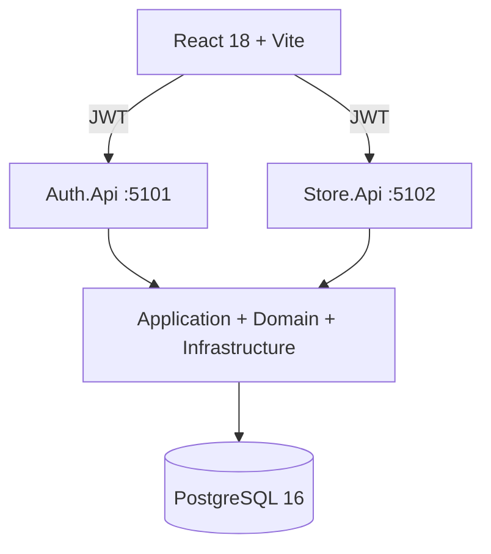
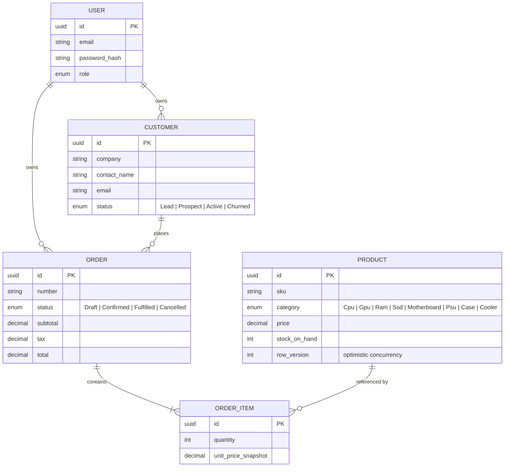
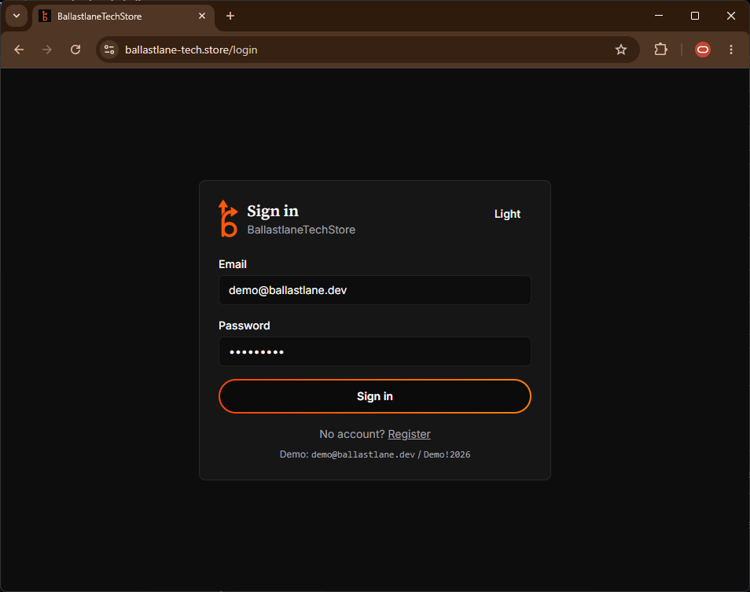
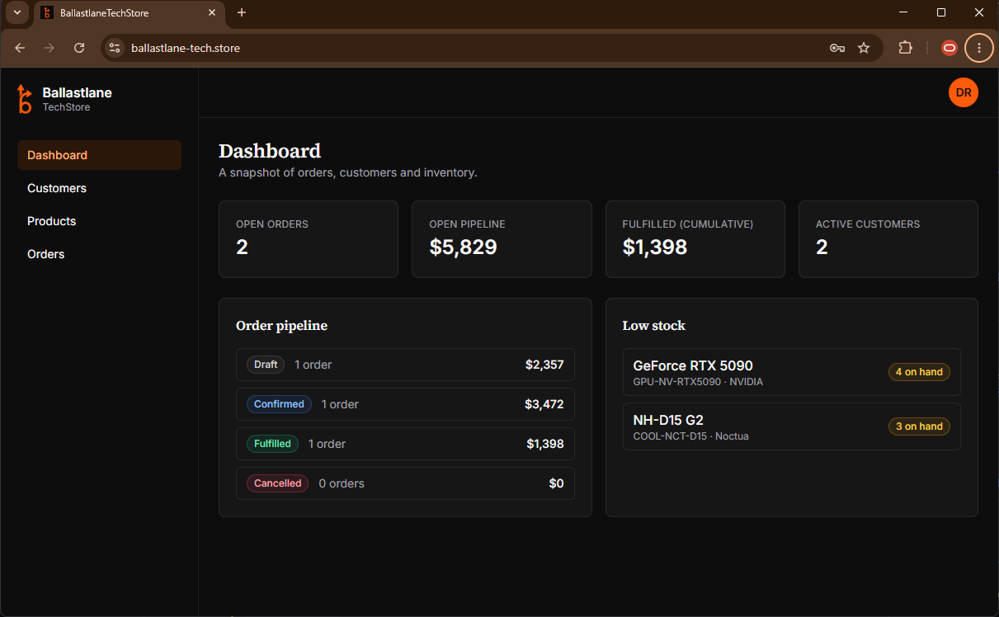
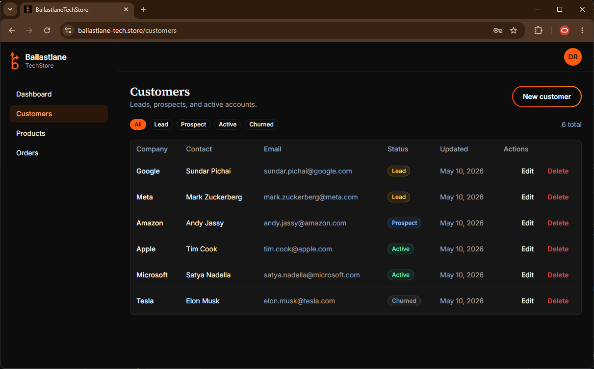

<h1>
  
  &nbsp;Ballastlane Tech Store
</h1>


A compact ERP-style application for a computer-parts store. It covers customer management, a categorized product catalog, and order processing with line items that **reserve/decrement stock when an order is confirmed**.

I built this as an end-to-end submission for the Ballastlane .NET technical exercise: two ASP.NET Core Web APIs over a shared Clean Architecture core, a React 18 + Vite frontend, PostgreSQL persistence without EF/Dapper/MediatR, seeded demo data, Docker Compose for local startup, and roughly 60 automated tests across Domain, Application, Infrastructure, and API integration suites.

Full brief: [`Technical Exercise - .Net`](docs/test.md).

The domain is intentionally as a parts store gives the backend a real business rule to protect: once an order is confirmed, line prices are snapshotted and stock is decremented in a transaction. If two users try to confirm overlapping orders for the same SKU, the second confirmation is rejected through optimistic concurrency. That keeps the architecture from becoming a thin CRUD wrapper and gives the tests something meaningful to prove.

The implementation uses modern .NET, REST APIs, PostgreSQL, Docker, AWS-oriented deployment documentation, React, clean code, automated tests, and clear engineering trade-offs.

**Repository:** <https://github.com/andrade-mcp/ballastlane-tech-store>

---

## Table of contents

- [Highlights](#highlights)
- [Submission fit](#submission-fit)
- [Architecture](#architecture)
- [Domain model](#domain-model)
- [Tech stack](#tech-stack)
- [Get started](#get-started)
- [Live demo & deployment](#live-demo--deployment)
- [Project structure](#project-structure)
- [Testing](#testing)
- [Development history](#development-history)
- [Engineering notes](#engineering-notes)
- [GenAI usage](#genai-usage)
- [Roadmap](#roadmap)
- [License](#license)

---

## Highlights

- Two ASP.NET Core Web APIs (Auth + Store) sharing one Application + Infrastructure layer.
- Clean Architecture with strict dependency direction - Domain knows nothing of frameworks.
- **No ORM.** Hand-written SQL via `Npgsql`. **No MediatR.** Plain service classes.
- Embedded SQL migrations applied automatically on startup with an idempotent ledger.
- Optimistic concurrency on stock decrement at order confirmation (per-row `row_version`).
- ~60 tests across four suites - Domain, Application, Infrastructure, API integration.
- React 18 + Vite + Tailwind frontend with light/dark theming and a brand CTA component.

---

## Submission Requirements

| Requirement | Where it is covered |
|-------------|---------------------|
| Clean Architecture | `Domain`, `Application`, `Infrastructure`, and API composition roots with one-way dependencies |
| Two Web APIs | `Auth.Api` for registration/login/authorized checks, `Store.Api` for customers/products/orders |
| CRUD over persisted data | Customer, product, and order endpoints backed by PostgreSQL repositories |
| No EF, Dapper, or MediatR | Repositories use hand-written SQL through `Npgsql`; use cases are plain application services |
| Independent business logic | Order/customer/product rules live outside controllers and outside persistence code |
| Unit/integration testing | Domain, Application, Infrastructure, and API integration test suites |
| Frontend integration | React/Vite UI consuming both APIs with JWT bearer auth |
| Seeded demo data | Demo user, products, customers, and orders are created automatically on startup |
| GenAI disclosure | Practical prompts, representative AI output, validation notes, and corrections documented below |

---

## Architecture



Dependency rule is one-way: outer layers depend on inner. `Application` defines ports
(`IOrderRepository`, `IPasswordHasher`, etc.) and `Infrastructure` implements them.
Both APIs are composition roots - controllers stay thin and delegate to application
services.

The two-API split is a literal reading of the brief, which asks for "a second API" for
authentication. It also makes the JWT bearer flow across service boundaries an explicit
part of the design rather than an aside.

---

## Domain model



---

## Tech stack

| Layer        | Choice                                                                |
|--------------|------------------------------------------------------------------------|
| Language     | C# 13 / .NET 9                                                         |
| Web          | ASP.NET Core Web API, JWT bearer auth                                  |
| Persistence  | PostgreSQL 16, hand-written SQL via `Npgsql` (no EF / Dapper)          |
| Migrations   | Embedded `.sql` resources + idempotent runner                          |
| Auth         | `BCrypt.Net-Next` for hashing, `System.IdentityModel.Tokens.Jwt`       |
| Tests        | xUnit, FluentAssertions, NSubstitute, `WebApplicationFactory`          |
| Frontend     | React 18, TypeScript, Vite, Tailwind v3                                 |
| Data fetching| `@tanstack/react-query` + axios with bearer interceptor                |
| Forms        | `react-hook-form` + `zod`                                              |
| Container    | Docker Compose: `postgres` + `auth-api` + `store-api`                  |

---

## Get started

> [!NOTE]
> Migrations and the demo seed run automatically on first API startup - no `dotnet ef`
> step. Postgres is mapped to host port **5434** (not 5432) to avoid clashing with a
> local install.

### Requirements

- .NET 9 SDK
- Node.js 20+
- Docker Desktop

### One-command start (Docker)

```bash
docker compose up -d
```

Brings up:

| Service     | Address                | Notes                                          |
|-------------|------------------------|------------------------------------------------|
| `postgres`  | `localhost:5434`       | host port 5434 to dodge any local pg on 5432   |
| `auth-api`  | `http://localhost:5101`| Swagger at `/swagger`                          |
| `store-api` | `http://localhost:5102`| Swagger at `/swagger`                          |

Migrations and demo seed run automatically on first API startup.

### Frontend

```bash
cd web/ballastlane-tech-store-web
npm install
npm run dev
```

Open <http://localhost:5174>.

### Demo credentials

```
email:    demo@ballastlane.dev
password: Demo!2026
```

The seed loads 10 products, 6 big-tech customers spread across the lifecycle, and 3 orders
in different pipeline states.

### Reset the database

```bash
docker compose down -v
docker compose up -d
```

### Without Docker (Postgres only)

```bash
docker compose up -d postgres
dotnet run --project src/BallastlaneTechStore.Auth.Api
dotnet run --project src/BallastlaneTechStore.Store.Api
```

The frontend reads `VITE_AUTH_API` / `VITE_STORE_API` from `.env`; defaults already point
at `http://localhost:5101` / `http://localhost:5102`.

---

## Live demo & deployment

Live at **<https://ballastlane-tech.store/>** - sign in with `demo@ballastlane.dev` /
`Demo!2026`. The seed runs on a fresh database, so the demo credentials work against
the live deployment as well as locally.

### Screens

| Sign in | Dashboard | Customers |
|---|---|---|
|  |  |  |
| Sign-in - brand CTA, dark theme by default, demo creds shown inline. | Dashboard - KPI tiles, order pipeline grouped by status, low-stock watchlist. | Customers - lifecycle-status filter chips, inline edit/delete, paginated table. |

Hosted on **AWS**, running the same images built from `docker-compose.prod.yml`.

### AWS resources

| Component                | AWS service                                                                                            |
|--------------------------|--------------------------------------------------------------------------------------------------------|
| Container runtime        | **ECS on Fargate** - one task definition per service (`auth-api`, `store-api`, `web`)                  |
| Image registry           | **Amazon ECR** - private repo per service, tagged with branch + commit SHA                             |
| Database                 | **Amazon RDS for PostgreSQL 16** - same migration ledger applies on first boot                         |
| Edge / TLS / routing     | **Application Load Balancer + AWS Certificate Manager** - host-based routing for the API + web targets |
| DNS                      | **Route 53** - hosted zone for `ballastlane-tech.store`                                                |
| Secrets                  | **AWS Secrets Manager** - JWT signing key and DB credentials, injected as env into the ECS task        |
| Logs                     | **Amazon CloudWatch Logs** - stdout from both APIs and the nginx web container                         |
| CI identity              | **IAM OIDC role** - GitHub Actions assumes a deploy role; no long-lived AWS keys in the repo           |

### CI/CD pipeline

GitHub Actions on push to `main`:

1. **Restore, build, test** - `dotnet restore`, `dotnet build`, `dotnet test` across
   all four suites (Domain, Application, Infrastructure, API integration). The
   frontend runs `npm ci` and `npm run build` as an early compile check. Pipeline
   aborts on red.
2. **Authenticate to AWS** - `aws-actions/configure-aws-credentials@v4` assumes the
   deploy role via **OIDC**; no static `AWS_ACCESS_KEY_ID` lives in repo secrets.
3. **Build & push images** - Docker buildx builds `auth-api`, `store-api`, and `web`
   in parallel, tagging each as `${ECR_URI}/<service>:${{ github.sha }}` plus
   `:latest`, and pushes to **ECR**.
4. **Render task definitions** -
   `aws-actions/amazon-ecs-render-task-definition@v1` substitutes the new image
   SHAs into the existing task-def JSON checked into the repo.
5. **Rolling deploy** - `aws-actions/amazon-ecs-deploy-task-definition@v2` updates
   each ECS service. The ALB drains old tasks once new tasks pass target-group
   health checks, then terminates them. **Rollback** is a re-run of the previous
   workflow with the prior SHA - no manual console steps.

Migrations and the demo seed stay owned by the application: each API runs its
embedded migration ledger on startup, so the pipeline does not need a separate
`migrate` step. Adding one is a `0002_*.sql` drop-in, not a workflow change.

---

## Project structure

```
src/
├── BallastlaneTechStore.Domain/
│   ├── Common/             DomainException.cs
│   ├── Entities/           User.cs, Customer.cs, Product.cs, Order.cs, OrderItem.cs
│   └── Enums/              Enums.cs (Role, CustomerStatus, ProductCategory, OrderStatus)
├── BallastlaneTechStore.Application/
│   ├── Abstractions/       IClock, IPasswordHasher, IJwtTokenIssuer, Repositories.cs
│   ├── Common/             Exceptions.cs (NotFound, Conflict, OutOfStock, ...)
│   ├── Dtos/               request/response DTOs
│   ├── Mapping/            Maps.cs (entity ↔ DTO)
│   ├── Services/           AuthService, CustomerService, ProductService, OrderService
│   └── DependencyInjection.cs
├── BallastlaneTechStore.Infrastructure/
│   ├── Auth/               BcryptPasswordHasher.cs, JwtTokenIssuer.cs, JwtSettings.cs
│   ├── Common/             SystemClock.cs
│   ├── Persistence/
│   │   ├── Migrations/     0001_init.sql (embedded resources)
│   │   ├── Repositories/   {User,Customer,Product,Order}Repository.cs + OrderConfirmationUnitOfWork
│   │   ├── MigrationRunner.cs
│   │   └── Seeder.cs       demo customers - products - orders
│   ├── Web/                JwtAuthExtensions.cs, ExceptionMiddleware.cs
│   └── DependencyInjection.cs
├── BallastlaneTechStore.Auth.Api/             :5101
│   ├── Controllers/        AuthController.cs (register / login / me)
│   └── Program.cs
└── BallastlaneTechStore.Store.Api/            :5102
    ├── Common/             CurrentUser.cs (JWT claim helper)
    ├── Controllers/        CustomersController, ProductsController, OrdersController
    └── Program.cs

tests/
├── BallastlaneTechStore.Domain.Tests/         OrderTests, ProductTests, UserAndCustomerTests
├── BallastlaneTechStore.Application.Tests/
│   ├── TestSupport/        InMemoryRepos.cs
│   └── *ServiceTests.cs    Auth, Order, Customer + Product
├── BallastlaneTechStore.Infrastructure.Tests/ PasswordHasherAndJwtTests
└── BallastlaneTechStore.Api.Tests/
    ├── TestSupport/        TestApiFactory.cs, InMemoryStore.cs
    └── *ApiTests.cs        AuthApi, StoreApi (WebApplicationFactory)

web/ballastlane-tech-store-web/                Vite + React 18 + TS + Tailwind v3
├── src/
│   ├── components/         AppLayout, BrandButton, Modal, StatusPicker, UserMenu, Badges
│   ├── features/
│   │   ├── auth/           AuthProvider.tsx (token + /me)
│   │   └── theme/          ThemeProvider.tsx (light/dark, localStorage)
│   ├── lib/                api.ts (axios + bearer interceptor), types.ts, format.ts
│   ├── pages/              Login, Register, Dashboard, Customers, Products, Orders, OrderDetail
│   └── styles/globals.css  brand tokens on :root / .dark
└── vite.config.ts

docker-compose.yml                              postgres + auth-api + store-api
```

---

## Testing

```bash
dotnet test
```

All suites are self-contained:

- Domain + Application use hand-written in-memory fakes.
- Infrastructure unit tests cover BCrypt and the JWT issuer.
- API integration boots the full ASP.NET host with the in-memory repos via
  `WebApplicationFactory` - no live PostgreSQL required.

Total: 60 tests, all green.

---

## Development history

The work was committed in small, reviewable steps over three days: backend first, then frontend, then documentation/deployment polish. The commit history is intentionally atomic (`feat`, `fix`, `test`, `docs`, `style`, `chore`) so a reviewer can follow the design rather than reverse-engineer one large final commit.

A few examples of the progression:

- **Day 1 - backend foundation:** solution/projects, domain entities and invariants, application services/ports, Npgsql repositories, JWT auth, two APIs, and integration tests.
- **Day 1 - frontend:** React/Vite scaffold, authenticated pages, server-state handling, forms, and the first pass of the UI.
- **Day 2 - product polish:** theme tokens, status picker, seeded demo data, brand button, and README diagrams.
- **Day 3 - deployment hardening:** production compose overlay, deployment runbook, migration race fix with a PostgreSQL advisory lock, and live-demo documentation.

---


### Migrations

Every `.sql` file under
[`src/BallastlaneTechStore.Infrastructure/Persistence/Migrations/`](src/BallastlaneTechStore.Infrastructure/Persistence/Migrations/)
is embedded into the assembly and applied in lexicographic order on API startup, inside a
transaction, with applied filenames tracked in a `__migrations` ledger table. Adding a
migration is dropping a `0002_whatever.sql` into the folder. Idempotent and EF-free.

### Concurrency model

The order confirmation flow is the only place where two clients can race on the same row
(two reps confirming overlapping orders for the same product). The design uses
**optimistic concurrency** on `products.row_version`: the conditional `UPDATE` only
succeeds if the row hasn't moved since the caller read it. A failed update collapses the
whole transaction with `OutOfStockException`, surfacing as `409 Conflict` to the client.

The boundary lives behind `IOrderConfirmationUnitOfWork` so the application layer stays
agnostic of the transaction mechanics.

---

## GenAI usage

The exercise asks for GenAI disclosure, including prompts, representative output, validation, corrections, and edge-case handling. I used Claude Code as a senior-developer assistant during the build, mainly to speed up bounded work that I could review quickly: test enumeration, repetitive scaffolding, SQL syntax recall, frontend component polish, Docker/deployment troubleshooting, and README structure.

I did **not** use AI as the architect of the project. The two-API split, Clean Architecture boundaries, domain model, order-confirmation transaction, optimistic-concurrency strategy, repository ports, and test ordering were decided before prompting. My workflow was closer to pairing with a fast junior/mid-level assistant: give it a narrow task, review the output, run the tests, and keep or rewrite only what survived review.

### Example prompt requested by the brief: task API scaffold

This is the type of prompt I would use for the task-management API example from the brief. It is intentionally specific because vague prompts tend to produce controller-heavy code that mixes HTTP, persistence, and business rules.

> build a small asp.net core task api scaffold using clean architecture.
>
> constraints:
> - .net 9 / c#
> - no ef core, no dapper, no mediatr
> - assume a basic User already exists
> - tasks belong to a user
>
> create:
> - TaskItem domain entity with id, userId, title, description, status, dueDate, createdAt, updatedAt
> - TaskStatus enum: Todo, InProgress, Done, Cancelled
> - application service: create, get by id, list by user, update, delete
> - repository interface in Application only
> - controller endpoints with normal REST verbs
> - validation: title required, due date cannot be in the past on create, only owner can read/update/delete
> - xunit tests for invalid title, past due date, unauthorized access, update, delete
>
> keep controllers thin. business rules stay in domain/application. no solution dump - show representative files only.

Representative output I would expect from that prompt is an entity + service shape like this:

```csharp
public sealed class TaskItem
{
    public Guid Id { get; private set; }
    public Guid UserId { get; private set; }
    public string Title { get; private set; }
    public string? Description { get; private set; }
    public TaskStatus Status { get; private set; }
    public DateOnly DueDate { get; private set; }

    public static TaskItem Create(Guid userId, string title, string? description, DateOnly dueDate, DateOnly today)
    {
        if (string.IsNullOrWhiteSpace(title))
            throw new ValidationException("Title is required.");

        if (dueDate < today)
            throw new ValidationException("Due date cannot be in the past.");

        return new TaskItem(Guid.NewGuid(), userId, title.Trim(), description, TaskStatus.Todo, dueDate);
    }
}
```

I would not paste that blindly. I would check ownership checks, validation placement, exception mapping, SQL parameterization, and tests before accepting it.

### AI commands that match the actual build history

Below are representative prompts from the project, written in the same short, practical style I used while building. They follow the git history: bootstrap, domain/TDD, application ports, infrastructure, APIs, frontend, Docker, deployment, and documentation.

#### Phase 1 - Bootstrap and backend

> create the solution layout for this exercise. .net 9. projects: Domain, Application, Infrastructure, Auth.Api, Store.Api. tests for domain/application/infra/api. wire references clean architecture style. no ef, no dapper, no mediatr.

What I kept: the project split and reference direction. What I checked manually: that `Domain` had no dependency on anything else, `Application` depended only on `Domain`, and API projects were composition roots only.

> domain entities for a small computer parts store. User, Customer, Product, Order, OrderItem. include enums for role, customer status, product category, order status. put invariants in methods, not controllers. order can confirm only with lines, cannot add lines after confirm, cancel fulfilled should fail.

What I changed: I tightened the order state transitions myself. AI is decent at generating entities, but it often treats state machines as loose property setters, which would weaken the exercise.

> tests for this. xunit + fluentassertions. cover the cant-do paths: cant add lines after confirmed, confirm with no lines throws, confirm reprices from current product prices, cancel fulfilled throws, cancel cancelled is idempotent. one file, no fixtures.

What I changed: the first output asserted mostly on `Order.Status`. I added assertions for the stock-decrement list returned by `Confirm()`, because that is the important business output used by the transaction.

> application layer ports and services. interfaces for users/customers/products/orders. services should not know npgsql or asp.net. use simple request/response dtos. throw app exceptions: not found, conflict, validation, out of stock.

What I kept: the service shape and exception categories. What I corrected: a couple of generated methods tried to return repository entities directly; I moved them back through DTO mapping so the API contract stayed separate.

> in-memory test repos for application tests. no mocks unless needed. keep behavior close to repo contracts. make auth service tests cover duplicate email, bad login, happy login, me endpoint data.

What I kept: in-memory fakes. This made the application tests easier to read than a heavy mock setup.

> npgsql repositories for user/customer/product/order. hand-written sql. map rows manually. no dapper helpers. keep sql boring and parameterized.

What I reviewed carefully: every query parameter, nullable field, enum conversion, and transaction boundary. SQL is an area where I do not trust generated code without reading it line by line.

> npgsql update for product stock. decrement stock_on_hand by qty only when id matches, row_version matches, and stock_on_hand >= qty. increment row_version. return rows affected. no dapper, no ef.

What I kept: the conditional `UPDATE` shape. What I added: wrapping order persistence + stock updates in a single unit-of-work transaction so a partial confirmation could not be committed.

> tiny pg migration runner. embedded .sql files under this assembly prefix, lexicographic order, idempotent __migrations table, NpgsqlDataSource, cancellation token. keep it boring.

What I changed: I put it behind an abstraction so the API integration test factory could replace it. That kept tests fast and avoided a live PostgreSQL dependency.

> bcrypt password hasher and jwt issuer for .net 9. use options for issuer/audience/key/expiry. tests should verify password roundtrip and token has expected claims.

What I checked: token signing key handling, claim names, expiry, and that tests did not assert on fragile token string internals.

> auth api controllers: register, login, me. thin controllers. problem details middleware. swagger bearer config. authorized and anonymous endpoint because exercise asks for both.

What I corrected: AI initially over-handled validation in the controller. I moved it back into the service/domain path and left the controller as HTTP translation.

> store api controllers for customers/products/orders. jwt required. current user from claims helper. crud endpoints plus confirm order. return 409 for business conflicts.

What I validated: status codes, route naming, authorization attributes, and exception mapping.

> webapplicationfactory tests for both APIs with in-memory repos. cover register/login/me, customer crud, product crud, create order, confirm order. no real postgres.

What I kept: the integration-test strategy. What I changed: the test host setup so migrations/seeding could be no-oped during API tests.

#### Phase 2 - Frontend and UI

> vite react ts app for this api. pages: login, register, dashboard, customers, products, orders, order detail. use react-query and axios bearer interceptor. keep components simple.

What I kept: the page structure and React Query setup. What I reviewed manually: token persistence, `/me` refresh flow, and whether failed auth cleared state correctly.

> react-hook-form + zod forms for login/register/customer/product. show server validation messages without making the UI noisy.

What I changed: I simplified some generated form abstractions. For this size of app, readable local forms were better than a generic form factory.

> status picker component for customer grid. click badge opens popover with allowed next statuses. generic enough for reuse but don't over-engineer.

What I kept: the reusable `StatusPicker<T>` idea. What I adjusted: keyboard/focus behavior and styling so it did not feel like a raw dropdown in the table.

> tailwind v3 theme tokens for ballastlane-like dark default. orange #fe5a0b, serif headings, css variables, light/dark toggle, persist in localStorage.

What I changed: the first implementation wrote the theme on initial mount, which could pin stale values. I changed persistence so it only writes when the user actually toggles.

> tailwind v3 brand button. orange gradient border, dark inner fill, white text, hover wipe from left to right. no shadcn. keep it accessible and reusable.

What I corrected: the first pass used a theme background that made text disappear in light mode. I pinned the inner fill to a dark value and made the text color explicit.

> avatar menu in the header. initials, user email, theme toggle, sign out. replace the loose sign-out button.

What I validated: sign-out cleared the token, query cache, and protected UI state.

> this popover background is transparent in tailwind. inspect likely missing tokens in tailwind config and fix without changing component behavior.

What I kept: the diagnosis. The generated answer pointed to missing `popover` / `secondary` tokens, which matched the actual issue.

#### Phase 3 - Seed data, theming, and polish

> replace placeholder seed data with believable computer-parts demo data. 10 products across cpu/gpu/ram/ssd/motherboard/psu/case/cooler. 6 customers across lead/prospect/active/churned. 3 orders in different statuses.

What I changed: I edited the seed to make the demo coherent and not random. Seed data is part of the presentation, so it needed to feel intentional.

> make product grid price and stock columns centered. minimal diff only.

What I kept: the small patch. This is exactly the type of low-risk cleanup where AI is useful.

> read this README and make it sound like an experienced .net dev wrote it. keep it honest, avoid marketing fluff, emphasize tradeoffs, tests, no orm, two apis, concurrency.

What I changed: I kept the structure but rewrote sections that sounded too polished or generic. The README should read like a technical submission, not a landing page.

> add mermaid diagrams for component architecture and er model. keep labels short so github renders cleanly.

What I validated: GitHub-flavored Mermaid syntax and whether the diagrams matched the actual code structure.

#### Phase 4 - Docker and deployment

> docker compose for postgres 16 + auth api + store api. map postgres to 5434. APIs expose 5101 and 5102. use env vars for db and jwt. one-command local startup.

What I checked: container networking, local port collisions, and whether the APIs could run migrations on startup.

> production compose overlay. bind api ports to localhost only, add web container with nginx, keep postgres internal, env-file friendly. include deploy readme commands.

What I changed: I reviewed port exposure manually. Production compose files are easy to get subtly wrong, especially around what is publicly reachable.

> compose overlay is still binding both base and prod ports. explain why and fix with the smallest yaml change.

What I kept: the diagnosis that Compose merges port lists. The fix was to use `!override` so the production overlay replaced the base port mapping instead of appending to it.

> two api containers race on migration startup. postgres duplicate key on pg_type_typname_nsp_index around __migrations creation. suggest safe fix.

What I kept: the advisory-lock approach. I wrapped the migration runner with a PostgreSQL advisory lock so cold starts from both APIs serialize migration execution.

> here is the kestrel error. windows command to find and kill whatever owns port 5101.

What I used: a quick PowerShell command to find the process by local port and stop it. This was development-loop help, not committed application logic.

#### Phase 5 - Post-deploy docs and final README

> add live demo section. include demo credentials, deployment shape, and what aws services would be used. keep it factual, not buzzwordy.

What I checked: that the README did not claim more than the project actually supported.

> write a concise development history from these commits. show progression over 3 days. don't paste the whole git log, summarize phases.

What I kept: the phase summary now in this README. It helps reviewers see that the project was built incrementally and tested along the way.

> tighten genai section with realistic prompts and correction notes. it should show ai helped me move faster, not that ai designed the system.

What I changed: I rewrote the section to make the senior-developer judgment explicit: prompts, output, validation, corrections, and boundaries.

### How I validated AI output

I treated AI output like a pull request from another developer:

- Ran `dotnet test` across Domain, Application, Infrastructure, and API integration suites.
- Checked that tests covered the business behavior, not just property assignments.
- Reviewed dependency direction so Domain/Application did not pick up ASP.NET, Npgsql, or frontend concerns.
- Read SQL manually for parameterization, enum mapping, transaction boundaries, and concurrency behavior.
- Exercised the frontend against the running APIs and checked the browser console.
- Rejected generated code that hid business rules in controllers, invented dependencies, mixed Moq/NSubstitute syntax, or asserted on implementation details.
- Kept AI-generated changes small enough to review as a normal commit.

### Corrections I made to AI output

- **Domain tests:** added assertions around returned stock decrements, not only order status.
- **Application services:** removed direct entity leaking from generated service responses.
- **Controllers:** moved validation/business decisions back out of controllers.
- **SQL:** wrapped order confirmation and stock updates in a transaction behind `IOrderConfirmationUnitOfWork`.
- **Migration runner:** added an abstraction for test replacement, then later serialized startup with a PostgreSQL advisory lock.
- **Frontend theme:** fixed light-mode contrast on the brand button and prevented stale localStorage theme values.
- **Docker compose:** corrected production port merging with `!override`.
- **README:** removed vague AI-sounding claims and replaced them with concrete engineering trade-offs.

### What I deliberately did not delegate

I did not ask AI to generate the whole project in one shot. I also did not let it choose the architecture, authentication flow, database schema, concurrency strategy, deployment model, or testing strategy. Those are the parts I expect to defend in review, so I kept ownership of them and used AI only on bounded, reviewable tasks.

---

## License

Interview material.
